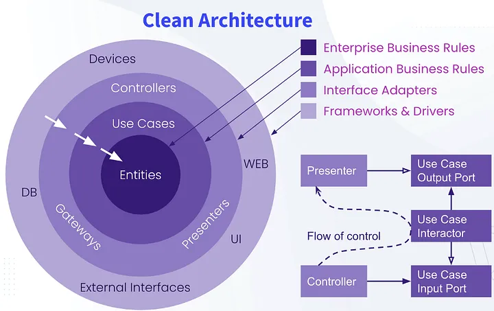

# DDD

## Software engineering practices for Domain Driven Design made in JavaScript/TypeScript

Inspired by (Rus): https://www.youtube.com/watch?v=cT-VOwWjJJs&t=2949s  
Presentation (Rus): https://drive.google.com/file/d/1tsptt7aRNJ3tWsGXHNhbJiRhHF_DDupo/view

> All examples are provided in JavaScript/TypeScript, considering the final host-environment as for NodeJS

### Keypoints

1. **Clean architecture**

On the image below we can see the distinct segregation of **business domain entities** and surrounding layers of its accessors, which are:
- **Application** (use cases)
- **Perphery interface adapters** (controllers, gateways, Presenters)
- **Infrastructure** (DB, clients, external interfaces)



This separation gives to the **Domain Drived Design** powerfull abstraction, reusability, maintainability characteristics based on isolating the **core** of a business model entities, i.e. the **domain**

2. **Entities**

We may think about these domain particulars named **entities** as of different sorts of interfaces.
Let's take a quick look on some example, demonstrating the core of such domain model as digital assets e-commerce platform.

```Typescript
/**
 * @entity Plain digital asset
 */
interface IDigitalAsset {
    name: string,
    description: string,
    type: TDigitalAssetsTypes,
}

/**
 * @entity Digital asset owned by a user (seller | customer)
 */
interface IOwnerDigitalAsset {
    asset: IDigitalAsset,
    owner: IOwner,
}

/**
 * @entity Platform user (seller | customer) with at least one digital asset
 */
interface IOwner {
    nickName: string,
    firstName: string,
    secondName?: string,
    assets: IOwnerDigitalAsset[],
}

type TDigitalAssetsTypes<T> = T
    | SubscritionType
    | ProgrammKeyType
    // ...
```

It's quite clear that even looking only at these interfaces we certainly could tell what are the *business entities* of business rules in considered domain. 

Here we can clearly see the business model:
- There're some digital assets like subsctiptions and programm keys, which sellers have and sell them to customers
- Both sellers and customers may own some digital assets
